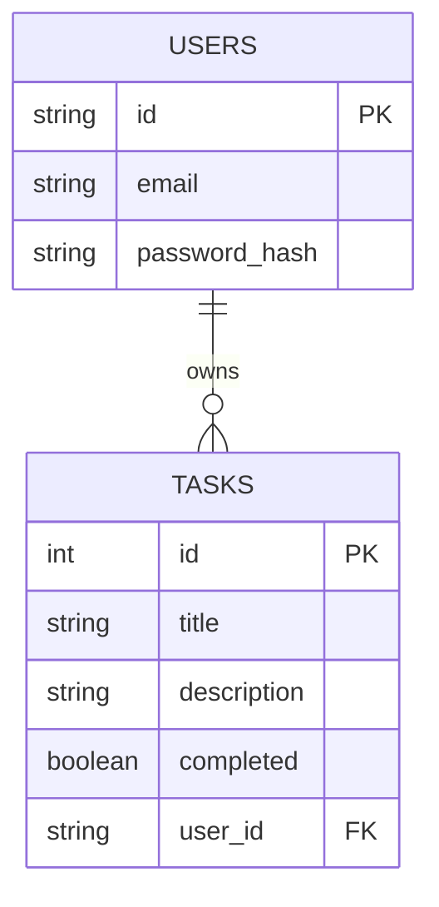
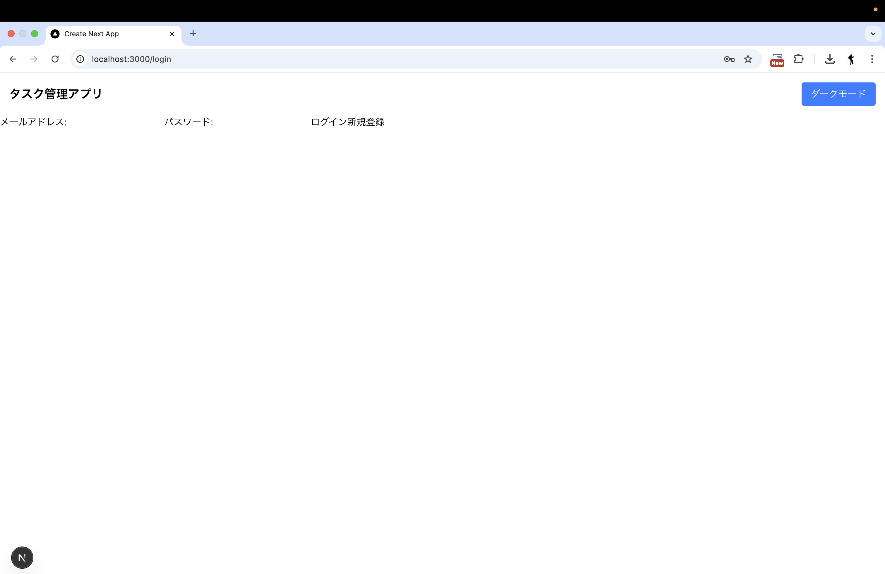
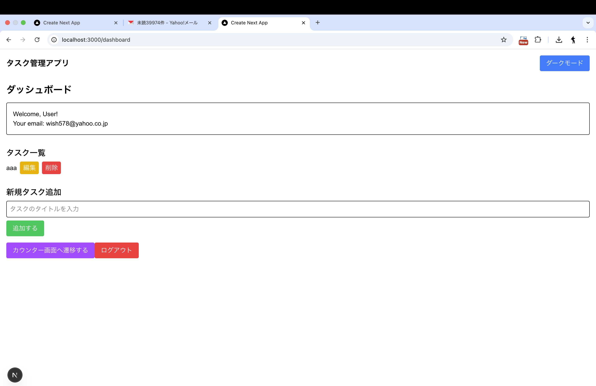
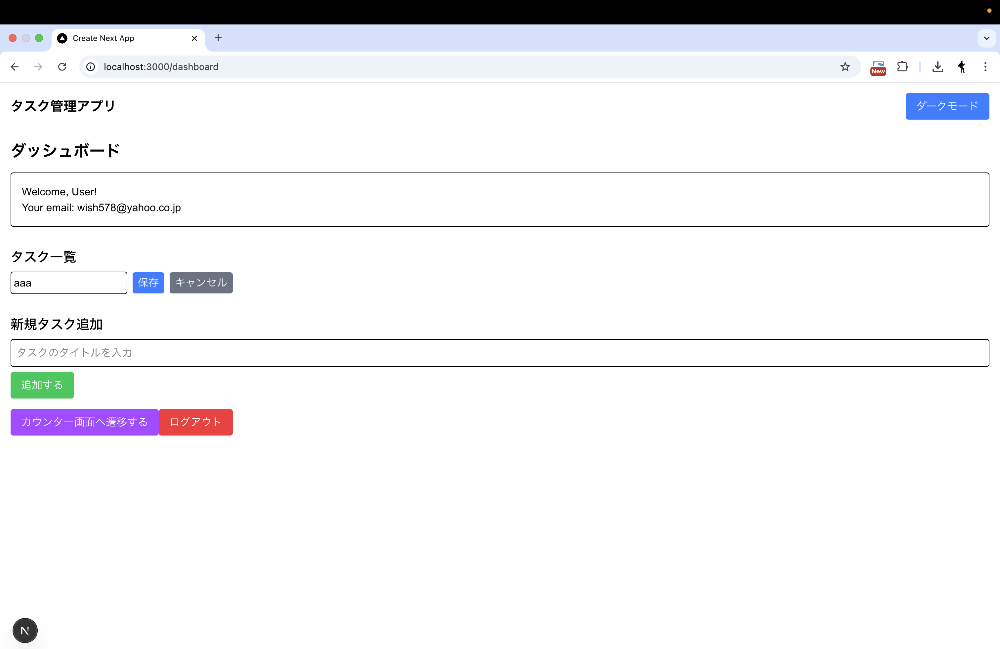
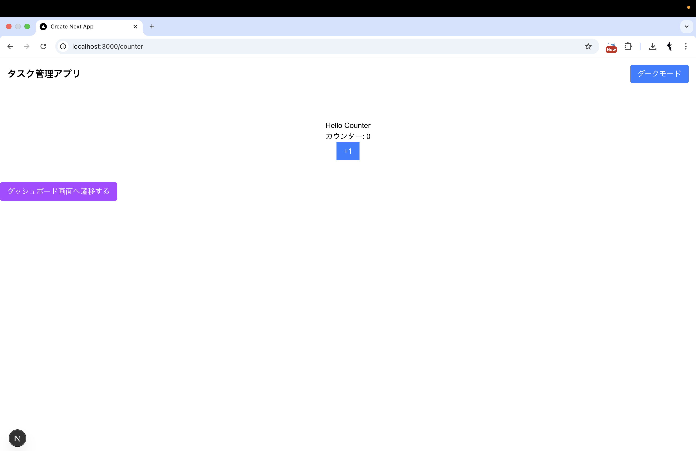
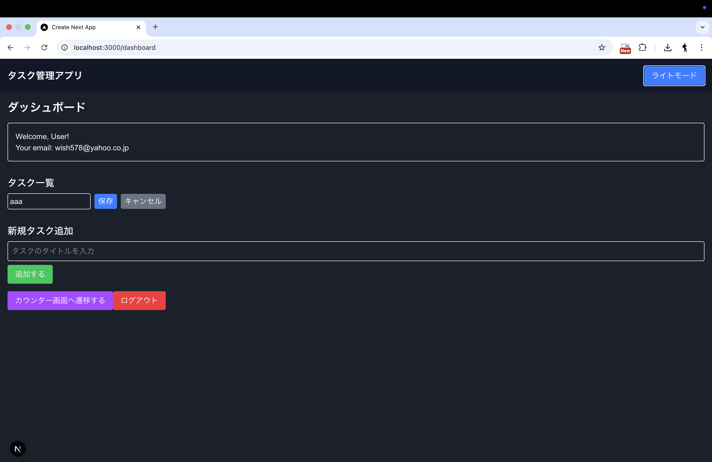

# Task Manager App

## 📌 概要
このプロジェクトは、Next.js + Supabase を使用したシンプルなタスク管理アプリです。  
ユーザー認証を備え、タスクの **作成・取得・更新・削除（CRUD）** を実装しています。

---

## 🏗️ セットアップ手順

### **1️⃣ リポジトリをクローン**
```sh
git clone https://github.com/nozomi2255/my-app.git
cd your-repo
```

### **2️⃣ 依存関係をインストール**
```sh
npm install
```

### **3️⃣ 環境変数を設定**
- `.env.local` を作成し、以下を記述
```sh
NEXT_PUBLIC_SUPABASE_URL=your-supabase-url
NEXT_PUBLIC_SUPABASE_ANON_KEY=your-supabase-anon-key
```

### **4️⃣ 開発サーバーを起動**
```sh
npm run dev
```
- [http://localhost:3000](http://localhost:3000) にアクセス

---

## 📂 主要ファイル構成
```
src/
├── app/
│   ├── api/
│   │   ├── auth/
│   │   │   ├── logout/
│   │   │   │   ├── route.ts
│   │   ├── tasks/
│   │   │   ├── route.ts
│   ├── counter/
│   │   ├── page.tsx
│   ├── dashboard/
│   │   ├── page.tsx
│   ├── login/
│   │   ├── actions.ts
│   │   ├── page.tsx
│   ├── favicon.ico
│   ├── globals.css
│   ├── layout.tsx
│   ├── page.tsx
│   ├── types.ts
├── components/
│   ├── DashboardClient.tsx
│   ├── Header.tsx
│   ├── LayoutWithTheme.tsx
│   ├── ThemeContext.tsx
├── utils/supabase/
│   ├── client.ts
│   ├── middleware.ts
│   ├── server.ts
├── middleware.ts
```

---

## 📊 ER 図（データベース構造）


---

## 🛠️ 利用技術
- **Next.js** (App Router)
- **TypeScript**
- **Supabase** (ユーザー認証 & データ管理)
- **Tailwind CSS** (スタイル適用)
- **ESLint & Prettier** (コードフォーマット)

---

## 🚀 デプロイ
このプロジェクトは、Vercel で簡単にデプロイできます。
[Next.js のデプロイ手順](https://nextjs.org/docs/deployment) を参照してください。

---

## 🎯 ユーザーストーリー

### **1️⃣ ユーザー登録 & ログイン**
- **新規ユーザーは** アカウントを作成し、メールアドレスとパスワードでログインする。(登録したメールアドレスに認証用のリンクが届く。)
- **既存ユーザーは** 以前のログイン情報を使ってアクセスできる。



### **2️⃣ タスクの作成**
- **ユーザーは** タスクのタイトルと説明を入力して、新しいタスクを作成できる。
- **タスクは** 自動的にログイン中のユーザーに紐づく。



### **3️⃣ タスクの管理**
- **ユーザーは** 作成したタスクをリストで確認できる。
- **タスクは** 編集や削除が可能。



### **4️⃣ タスクの編集**
- **ユーザーは** 既存のタスクのタイトルや説明を変更できる。
- **編集後、データベースに即座に反映される。**


### **5️⃣ タスクの削除**
- **ユーザーは** 不要になったタスクを削除できる。
- **削除後のタスクは** 復元できない。


### **6️⃣ ログアウト**
- **ユーザーは** セッションを終了し、安全にログアウトできる。
- **ログアウト後、ログインページへリダイレクトされる。**


### **7️⃣ カウンター画面への遷移**
- **ユーザーは** ダッシュボードから「カウンター画面へ遷移する」ボタンをクリックできる。
- **カウンター画面では** 数値を増やす機能が提供されている。
- **カウンター画面から** 「ダッシュボード画面へ遷移する」ボタンをクリックすると、元のダッシュボードに戻ることができる。



### **8️⃣ テーマカラーの変更**
- **ユーザーは** ヘッダーの「ダークモード」ボタンをクリックして、テーマを **ライトモード / ダークモード** に切り替えられる。
- **選択したテーマ** は、ページをリロードしても維持される。



---
