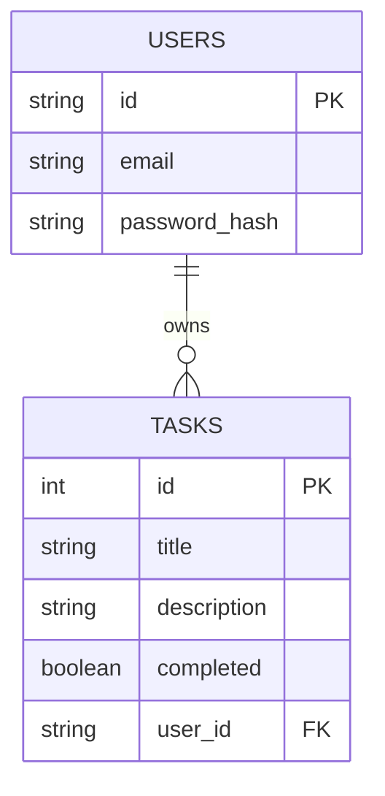

# Task Manager App

## 📌 概要
このプロジェクトは、Next.js + Supabase を使用したシンプルなタスク管理アプリです。  
ユーザー認証を備え、タスクの **作成・取得・更新・削除（CRUD）** を実装しています。

---

## 🏗️ セットアップ手順

### **1️⃣ リポジトリをクローン**
```sh
git clone https://github.com/your-repo.git
cd your-repo
```

### **2️⃣ 依存関係をインストール**
```sh
npm install
```

### **3️⃣ 環境変数を設定**
- `.env.local` を作成し、以下を記述
```sh
NEXT_PUBLIC_SUPABASE_URL=your-supabase-url
NEXT_PUBLIC_SUPABASE_ANON_KEY=your-supabase-anon-key
```

### **4️⃣ 開発サーバーを起動**
```sh
npm run dev
```
- [http://localhost:3000](http://localhost:3000) にアクセス

---

## 📂 主要ファイル構成
```
src/
├── app/
│   ├── api/
│   │   ├── auth/
│   │   │   ├── login.ts
│   │   │   ├── logout.ts
│   │   ├── tasks/
│   │   │   ├── route.ts
│   ├── components/
│   │   ├── DashboardClient.tsx
│   ├── types.ts
│   ├── page.tsx
├── public/
├── styles/
│   ├── globals.css
│   ├── Home.module.css
├── README.md
```

---

## 📊 ER 図（データベース構造）


---

## 🛠️ 利用技術
- **Next.js** (App Router)
- **TypeScript**
- **Supabase** (ユーザー認証 & データ管理)
- **Tailwind CSS** (スタイル適用)
- **ESLint & Prettier** (コードフォーマット)

---

## 🔮 今後の学習計画
- **✅ 自動テスト導入** (`Jest`, `Cypress`)
- **✅ CI/CD 設定** (`GitHub Actions`)
- **✅ 高度な DB 設計**（タスクの「期限」や「カテゴリー」機能追加）

---

## 🚀 デプロイ
このプロジェクトは、Vercel で簡単にデプロイできます。
[Next.js のデプロイ手順](https://nextjs.org/docs/deployment) を参照してください。
